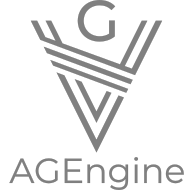

# AGE: Another Game Engine
<div align="center"></div>

<div align="center">
<p>
  
  
</p>
<p></p>
  <p>
    
    
    
  </p>
</div>

A game engine written in C++ just for fun and education. 
With it I'm learning concepts and practces underlying the creation of a game engine and some concepts related to github.

and for some info on project's future and some roadmap you can check [AGEngine project](https://github.com/users/nightingazer/projects/1)

Highly inspired by [Yan Chernikov's](https://github.com/TheCherno) [Hazel Engine](https://github.com/TheCherno/Hazel), thanks to him for his wonderfull series on the matter.

## Startup guide

To clone this repo with submodules run

``` bash
git clone --recurse-submodules https://github.com/nightingazer/AGE.git
```

### Ubuntu

By default GLFW is builded with x11, so in that case you should have xorg-dev installed on your system in order to build the AGE.
To install it run
```bash
sudo apt-get install xorg-dev
```
If you want to run the Sandbox app with Nvidia dGPU you should add `__NV_PRIME_RENDER_OFFLOAD=1` and `__GLX_VENDOR_LIBRARY_NAME=nvidia` to the environment variables of your run. (At least it works on my laptop with Intel iGPU and Nvidia dGPU)
